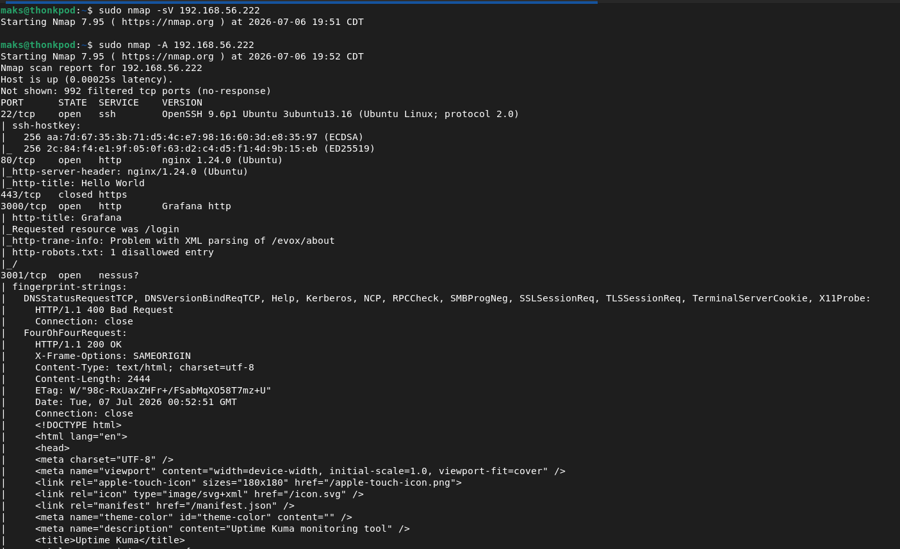
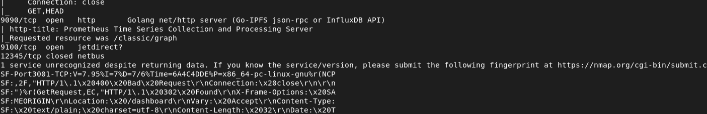
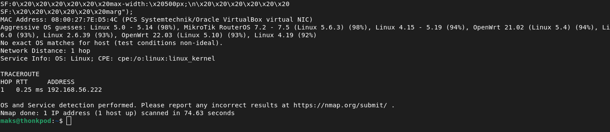
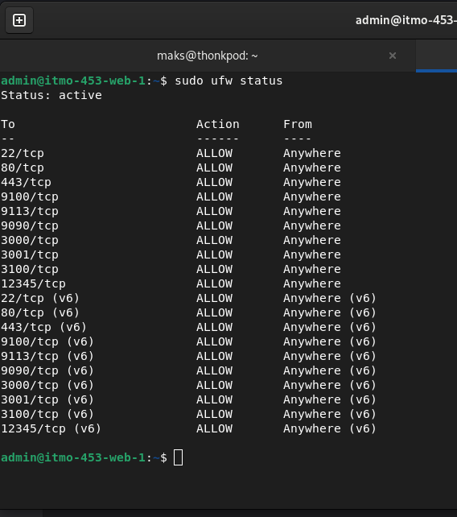
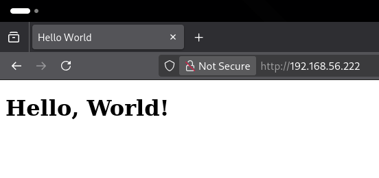
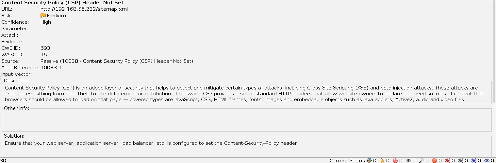
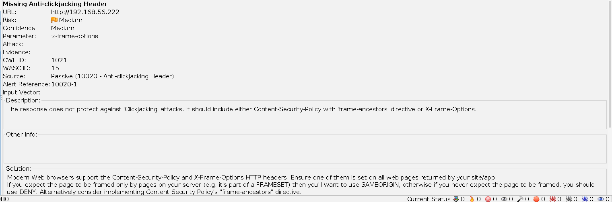
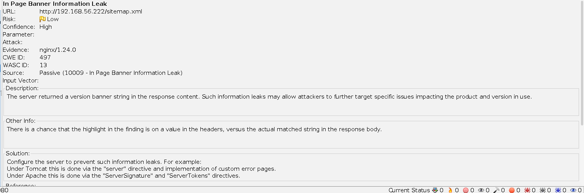
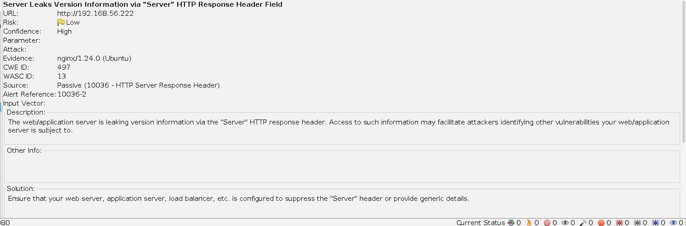
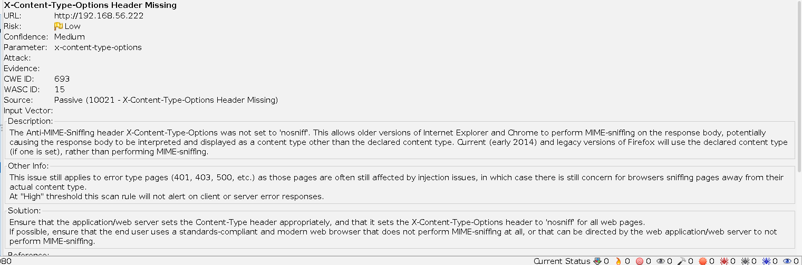

# Security Hardening Assessment

## Identified Vulnerabilities

### Nmap Scan 

#### Part 1

#### Part 2

#### Part 3

An nmap scan was conducted on the server as a standard first step in the vulnerability assessment. In total there were 8 total services identified with 6 of them being open. Nmap was also able to correctly identify 5 services that are installed on the system as well as the OS itself.

This is not good from a security standpoint because it allows an attacker to determine what is running on the machine. This allows the attacker to determine a plan of attack by analyzing the software if it is open source, or by installing it in their own environment and attempting to hack it.

The attacker could also exploit vulnerabilities in an operating system if they are able to correctly identify it.

### Firewall Rules Analysis

The next step of the vulnerability analysis involved examining the current firewall configuration. A few problems were identified. The first major issue was that the firewall allowed connections from IPv6 addresses. No services on this system rely on IPv6, so the firewall should not allow traffic from IPv6 sources.

There are also a few ports that are open unnecessarily. This system should only have the following ports open:

- 22 
- 80
- 443
- 3000
- 3001
- 9090

All other ports should be closed since there isn't any service that needs those ports open, nor is there any visible administration dashboard that needs to be accessible.

### Website Analysis

The third part of the the hardening assessment involved examining the website itself for vulnerabilities. The most glaring issue found was that the website did not employ https at all. This means that all web traffic was unencrypted.

### Webpage

### Webpage Vulnerability Scan

To further detect issues with the webservers configuration the Zed Attack Proxy (ZAP) vulnerability scanner was used to scan the site. This is an open-source vulnerability scanner that is used to determine configuration issues on websites and web applications and map them to CWE's.

Information about the tool can be found here: https://www.zaproxy.org/

### Identified Issues

CSP Header is not set

Missing Anticlickjacking Header

In Page Banner Information Leak

Server Leaks Version Information via "Server" HTTP Response Header Field

X-Content-Type-Options Header Missing

## Hardening and Remediation Checklist

The following steps will be taken to resolve the issues identified with this system:

1. Configure the server to use nginx as a proxy to reduc fingerprinting.

2. Create and deploy a self signed certificate to enable https.

3. Update firewall rules and close unnecessary ports.

4. Resolve all issues identified by ZAP Scanner

5. Change deployment order so that OpensScap scanner runs a scan and remediation before anything else is installed. 

## Threat Model

WIP

## Risk Analysis

WIP
