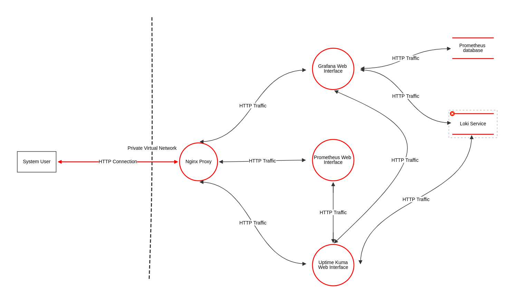

# Security Hardening Assessment

## Identified Vulnerabilities

### Nmap Scan 

#### Part 1

#### Part 2

#### Part 3

An nmap scan was conducted on the server as a standard first step in the vulnerability assessment. In total there were 8 total services identified with 6 of them being open. Nmap was also able to correctly identify 5 services that are installed on the system as well as the OS itself.

This is not good from a security standpoint because it allows an attacker to determine what is running on the machine. This allows the attacker to determine a plan of attack by analyzing the software if it is open source, or by installing it in their own environment and attempting to hack it.

The attacker could also exploit vulnerabilities in an operating system if they are able to correctly identify it.

### Firewall Rules Analysis

The next step of the vulnerability analysis involved examining the current firewall configuration. A few problems were identified. The first major issue was that the firewall allowed connections from IPv6 addresses. No services on this system rely on IPv6, so the firewall should not allow traffic from IPv6 sources.

There are also a few ports that are open unnecessarily. This system should only have the following ports open:

- 22 
- 80
- 443

All other ports should be closed since there isn't any service that needs those ports open, nor is there any visible administration dashboard that needs to be accessible. Nginx will be used as a proxy to prevent opening additional ports

### Website Analysis

The third part of the the hardening assessment involved examining the website itself for vulnerabilities. The most glaring issue found was that the website did not employ https at all. This means that all web traffic was unencrypted.

### Webpage

### Webpage Vulnerability Scan

To further detect issues with the webservers configuration the Zed Attack Proxy (ZAP) vulnerability scanner was used to scan the site. This is an open-source vulnerability scanner that is used to determine configuration issues on websites and web applications and map them to CWE's.

Information about the tool can be found here: https://www.zaproxy.org/

### Identified Issues

CSP Header is not set

Missing Anticlickjacking Header

In Page Banner Information Leak

Server Leaks Version Information via "Server" HTTP Response Header Field

X-Content-Type-Options Header Missing

## Hardening and Remediation Checklist

The following steps will be taken to resolve the issues identified with this system:

1. Configure the server to use nginx as a proxy to reduce fingerprinting.

2. Create and deploy a self signed certificate to enable https.

3. Rework nginx configuration so that other services are accessible via proxy

4. Update firewall rules and close unnecessary ports.

5. Resolve all issues identified by ZAP Scanner

6. Change deployment order so that OpensScap scanner runs a scan and remediation before anything else is installed. 

## Threat Model

OWASP Threat Dragon was used as a threat modeling tool for this system. This is an open source tool that is free to use. A STRIDE threat model was created and a report was generated. The full report is available as a PDF in this repository, while the diagram is inserted below for convenience.

More information about OWASP Threat Dragon can be found here: https://owasp.org/www-project-threat-dragon/

### STRIDE Diagram

## Risk Analysis

A total of 5 unique threats/risks to the system were identified as a part of the threat modeling and risk analysis. More detailed information about each specific threat as well as it's severity, mitigation strategy, and overall risk is listed bleow.

### Threat Breakdown

#### Threat 1: Unauthorized Login

Description: An attacker could take advantage of a weak password and gain
access to an administrators dashboard.

- Threat type: Elevation of Privilege
- SeverityL Medium
- Status: Open
- Score: 3

Mitigation: Implement a strong organisational
password policy.

Residual Risk After Mitigation: An attacker could still crack a password by exploiting flaws in application code or by social engineering. 

#### Threat 2: OS And Service Fingerprinting 

Description: An attacker could scan the system using
tools such as nmap and discover
information about running services and OS
info.

- Threat type: Information Disclosure
- Severity: High
- Status: Open
- Score: 5

Mitigation: Host services through a proxy and configure the system
to minimize the amount of information that is revealed.
Only open firewall ports that are absolutely necessary.

Residual Risk After Mitigation: An attacker could still make use of other techniques such as timing attacks to figure out information about a system and its services.

#### Threat 3: Eavesdropping 

Description: An attacker could listen in on http traffic over a public connection

- Threat type: Tampering
- Severity: High
- Status: Open
- Score: 5

Mitigation: Use HTTPS for all public connections.

Residual Risk After Mitigation: HTTPS alone does not completely solve the issue. There are still potential security issues such as weak tls, stolen/fake certificates, and poorly written application code.

#### Threat 4: DDOS Attack 

Description: An attacker could execute a denial of
service attack and bring down the system.

 - Threat type: Denial of Service
 - Severity: High
 - Status: Open
 - Score: 5

Mitigation: Implement protective measures such as fail2ban or
cloudflare.

Residual Risk After Mitigation: Cloudflare and fail2ban can minimize the risk of DDOS attacks but cannot fully stop misuse of a system, nor will they protect against flaws in code that allow exploits.

#### Threat 5: Log Contains Sensitive Data

Description: Logs are read by unauthorised users or made
public, sensitive data is then disclosed.

 - Threat type: Information disclosure
 - Severity: low
 - Status: Open
 - Score: 2

Mitigation: Minimise any sensitive data contained in logs,
consider encryption techniques

Residual Risk After Mitigation: Even if logs are encrypted there is still the possibility that someone can simply break into the logging system and obtain the logs that way. A flaw in the services code can also allow an attacker to decrypt the logs.